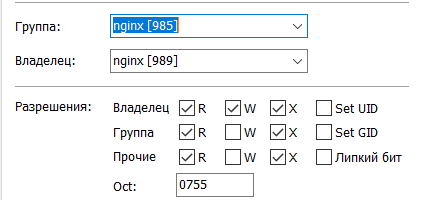

# Администрирование системы Базальта

# Настройка дашбордов
Выполняется в администрировании Django.

Панели дашбордов регистрируются по адресу:
Core -> Панели дашбордов

Панели привязываются к дашбордам:
Core -> Панели типов

# Настройки типов
Core -> Типы сущностей
Генератор обозначений - относительный адрес модуля генерации обозначений, например manufacture.generators.prodorder


# Настройка полей форм типов
Поля регистрируются по адресу:
Core -> Поля свойств в форме
Для полей, доступных только для чтения, например, заполняемых автоматически, нужно отмечать галочку "Только чтение".
Для ссылочных полей, заполняемых с помощью динамической подстановки (не фиксированного списка), моожно добавить дополнительный фильтр, влияющий на отбор значений. Для этого в поле **Ключи отбора подстановки** нужно вписать словарь с ключами, например:
{"part_type": "exemplar"}
Если по каким-то причинам нельзя заполнять поле при создании объекта, то нужно отметить галочку "Скрывать при создании", тогда в форме создания это поле отображаться не будет.

# Настройка отчетов
Пункт меню, связанный с отчетом, должен содержать:
Действие (ссылка) вида: report/workertasklist
где workertasklist имя отчета и раздела с настройками отчета
Отчеты описываются в разделе настроек Core - Отчеты


## Порядок добавления нового функционала
### На существующем дашборде

#### Добавление перечня полей
Core -> Поля свойств в форме
### На новом дашборде
Регистрируется соответствие типа и дашборда в настройках
Core -> Настройки типов
Указываются панели, которы нужно отобразить на данном дашборде
Core -> Панели типов

Дашборд *main* можно не добавлять - он используется по умолчанию.

## Принципы разработки дашбордов
Дашборды должны состоять из стандартных компонентов (каталог components)
Компоненты могут иметь условную отрисовку v-show, связанную с настройками Core -> Панели типов.
Предварительно каждый условно отображаемый компонент должен быть зарегистрирован в настройках Core -> Панели дашбордов.
Новый дашборд необходим в случае, если его функциональность существенно отличается от остальных уже существующих.

## Настройка файлового архива
Необходимо зарегистрировать файловый архив **def** (используемый по умолчанию.)
Пункт настроек Управление файловым архивом - Файловые архивы
в поле Корневой каталог архива нужно указать существующий каталог, в котором будут храниться файлы.
Пава доступа к архиву (ОС Linux) должны быть настроены следующим образом:

Установка прав осуществляется следующими командой:
```cmd
chown www-data:www-data /home/django/basalta/filestorage
```


## REST-сервисы
Ключевой атрибут - pk

### Сериалайзеры во ViewSet
serializer_class - используется при сохранении свойств объекта (и если не указаны ниже перечисленные). Содержит идентификаторы транзакций.
serializer_class_detailed - используется при отображении свойств объекта. Содержит раскрытия ссылок.
serializer_class_list - используется для списка объектов


## Принципы организации панелей интерфейса
Обновление по событию watch, завязанному на переменную из хранилища (selected_id, link_id)
Для создания сразу нескольких строк используется action postDataMany
Для сохранения изменений сразу в нескольких строках используется action patchDataMany
Для удаления сразу нескольких строк используется action deleteDataMany

## Принципы обработки ошибок
В модели выбрасывается исключение из зарегистрированных в rest.exceptions.
Исключение передается текст сообщения
JS отображает данное сообщение

# Организация фронтенда

## Обновление списков

# Исходный код
## Модели
В свойстве Meta обязательно указывать права, работающие с этой моделью. А по умолчанию:
```python
default_permissions = ()  # Отключение создания четырех прав по умолчанию
permissions = [('change_partlink', 'Связь Входит в. Редактирование'),
                       ('view_partlink', 'Связь Входит в. Просмотр')]
```
### Специфические свойства моделей записываются во встроенном классе BasaltaProps
```python
class BasaltaProps:
    """Подкласс для хранения специфических атрибутов для системы Базальта"""
    track_links = True  # В этой модели нужно отслеживать связи при замене экземпляра (используя метод replace)
```

# Администрирование прав достпа

## Доступ к состояниям
Необходимость контроля достпа к состояниям указывается в свойствах панелей дашбордов. Поле "Учитывать права доступа к состоянию".