# Работа в системе
## Вход в систему
Перед началом работы в системе пользователю необходимо авторизоваться.
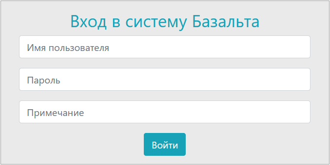

Дополнительно к имени пользователя (логину) и паролю пользователь может указать Примечание. Оно бывает полезно для пояснения всех внесенных во время последующего сеанса работы изменений.
После авторизации пользователь получает доступ к функционалу системы, на который ему выданы права доступа.
Для каждого пользователя в настройках можно указать пункт меню, который должен открывать после входа данного пользователя в систему.
Если в настройках ничего не указано, то открывается форма поиска.

## Основные элементы интерфейса системы
### Меню
В верхней части окна системы находится меню, предназначенное для перехода к разделам функционала системы.
Состав меню системы переменный и зависит от прав пользователя, вошедшего в систему.

### Рабочее окно
Рабочее окно пользователя делится на три основных зоны:
**Левая часть основного окна**
В большинстве случаев панель **Отбор**. На ней отображаются элементы фильтрации списков. Может быть свернута влево для осовобождения места на экране.
Форма **Фильтры** содержит набор полей для фильтрации списков объектов. Для каждого типа объектов этот набор может быть своим.

Фильтрация осуществляется по нажатию кнопки **Фильтровать**.
Очистка установленных фильтров и отображение неотфильтрованного списка осуществляется по нажатию кнопки **Очистить**.
**Средняя часть основного окна**
Окно, предназначенное для доступа к спискам, формам создания и редактирования, а также другим элементам фукнциоанал, требующим большого пространства. Элементы окна структурируются по вкладкам.
**Права часть основного окна**
Здесь расположен дополнительный функционал, динамически связанный с выбранным  в средней части элементом.

# Основные разделы функционала системы

## Поиск
Поиск осуществляется по наличию указанного фрагмента текста в обозначениях, наименования и описаниях элементов.

## Работа с общими справочниками
### Подразделения, контрагенты
Производственные подразделения и контрагенты в системе учитываются в едином справочнике **Справочники - Подразделения, контрагенты**

#### Создание нового контрагента или подразделения
В окрытом ранее справочнике открываем вкладку "Создать"

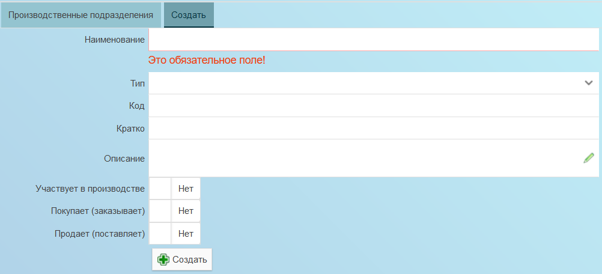

Заполняем свойства подразделения или контрагента:
* Наименование. Уникальное, понятное наименование контрагента или производственного подразделения.
* Тип. Цех, участок, внешний контрагент и т.п.
* Код. Код (номер) подразделения.
* Кратко. Краткая форма отображения подразделения (контрагента) в печатных ведомостях.
* Описание. Любая дополнительная поясняющая информация.
* Участвует в производстве. Если да, то данное подразделение (контрагента) можно указывать в производственных маршрутах.
* Покупает (заказывает). Тогда контрагент может быть указан как заказчик или покупатель.
* Продает (поставляет). Тогда контрагент может быть указан как поставщик (продавец) материалов и комплектующих.
Нажимаем кнопку "Создать".

## Работа с файловым архивом
Система позволяетприсоединять  файлы к разным типам объектов:
* Элементы конструкции
* Документы архива
* Письма
* Задания

Все зависит от текущих настроек системы и прав пользователя. Для манипуляций с файлами используется вкладка **Файлы** на форме редактирования свойств объекта, к которому относятся файлы.
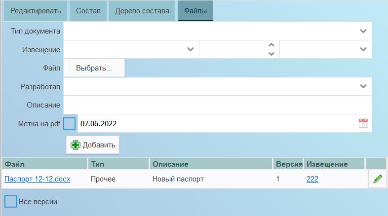
### Добавление файла
Добавление в архив новых файлов осуществляется с помощью формы на вкладке **Файлы**. В форме указывается:
* Тип документа. Значение из списка. Не обязательно для заполнения.
* Извещение. Выбирается из перечня зарегистрированных в системе извещений. Не обязательно для заполнения.
* Номер изменения. Целое число. Не обязательно для заполнения.
* Тип изменения. Значение из фиксированного списка. Не обязательно для заполнения.
* Файл. Открытие далога для выбора файла (файлов) на диске. Обязательное поле. Обязательно для заполнения. Файл (файлы) можно добавлять в форму с помощью механизма "драг-н-дроп".
* Разработал. Разработчик файла из списка разработчиков. Не обязательно для заполнения. По умолчанию заполняется соотвествующим текущеу пользователю разработчиком.
* Метка на pdf. Отметка о необходимости втсвки метки с датой на поле pdf-файла при помщения в архив. Не обязательно для указания. Дату можно изменить.
После указания файлов система может сообщить, что в архиве уже имеются указанныйе файлы. При совпадении файла с добавляемым будет исползована имеющееся в архиве версия.
После нажатия кнопки "Добавить" указанные файлы и информация о них будет добавлена в архив.
Нажатие кнопки "Очистить форму" очищает всю введенную в форму информацию.

### Редактирование файла
Для редактирования информации о файле нужно в соотвествующей файлу строке нажать кнопку **Редактировать** 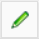. Информация о файле будет добавлена в расположенную над перечнем форму.
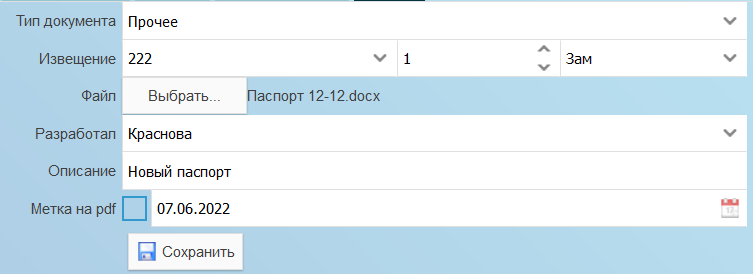
После изменения файла и (или) информации нажимается кнопка **Сохранить** для сохранения изменений.

### Удаление файла
Для удаления файла, нужно выделить содержащую его строку. При этом в нижней части списка появятся кнопки:
**Отвязать** 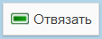. После нажатия кнопки выделенный файл будет отсоединен от текущего объекта.
**Удалить из архива** 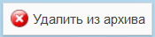. После нажатия кнопки выделенный файл и вся информация о нем будут удалены из архива. При этом физического удаления файла из архива не происходит. Сделать это (физически удалить файл) может только администратор.

Если нужно **ЗАМЕНИТЬ** файл в архиве, то **не нужно** его удалять, а нужно редактировать: 
* нажать кнопку Карандаш в соответствующей строке,
* выбрать новый файл
* нажать кнопку Сохранить
Тогда новый файл заменит предыдущий.

## Архивные документы
Доступ к архивным документам осужествляется путем выбора пункта меню **Архив - Архивные документы**.
Откроется форма работы с перечнем архивных документов. На расположенной по центру вкладке **Архивные документы** представленн перечень всех зарегистрированных в системе архивных документов. С помощью На расположенной слева панели **Отбор - Фильтры** можно отфильтровать перечень по фрагменту обозначения. 

### Создание архивного документа
На вкладке **Создать** (видна при наличии соотвествующих прав доступа) отображается форма создания архивного документа

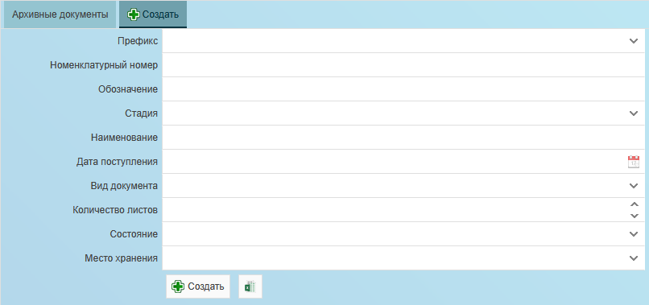

На которой нужно заполнить свойства создаваемого архивного документа и нажать кнопку **Создать**.

### Документ касается
Вкладка **Документ касается** расположенная справа от формы свойств архивного документа на панели **Дополнительно** предназначена для указания объектов состава, которых касается текущий архивный документ.

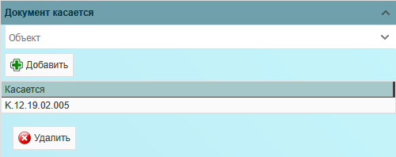

В нижней части формы расположен перечень объектов, которых касается данный документ. Двойной клик на строке перечня открывает на новой вкладке форму свойств данного объекта.
Для добавления нового объекта в перечень нужно ввести в поле **Объект** обозначение объекта, который нужно добавить и нажать кнопку **Добавить**.
**ВНИМАНИЕ!** добавлять можно только объекты, уже существущие в базе данных системы. Если объект отстуствует в списке подстановки поля, то его нужно предварительно создать (см. [Создание нового элемента конструкции](#создание-нового-элемента-конструкции)).

## Выдачи архивных документов
### Создание выдачи
создается выдача (меню **Архив - Выдачи** вкладка Создать), указывается Дата и Подразделение-получатель ( ЦКБ МТ Рубин) .
В созданной выдаче на панели справа указываете номер экземпляр и архивный документ ДК.650.01.00.000, нажимаете кнопку "Добавить".

## Коммуникации и управление
### Работа с письмами
Доступ к перечню писем осуществляется по выбору пункта меню **Управление - Письма**.
В открывшемся окне можно просматривать зарегистрированные в системе письма и регистрировать новые.

Для регистрации нового письма нужно переключиться на вкладку **Создать** (отображается при наличии у пользователя прав),
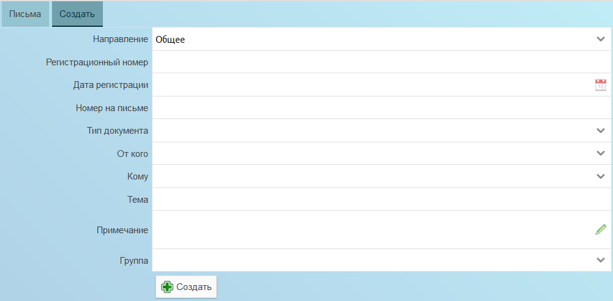

заполнить свойства письма и нажать кнопку **Создать**.

## Работа с архивом
### Архив инцидентов
Доступ к архиву инцидентов осуществляется по выбору пункта меню **Архив - Инциденты**.
В открывшемся окне можно просмтаривать инциденты, зарегистрированные на данный момент в системе и регистрировать новые.
Для фильтрации перечня инцидентов используется расположенная слева панель фильтров (ее можно свернуть).
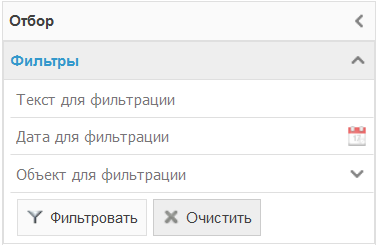

Для регистрации нового инцидента нужно переключиться на вкладку **Создать** (отображается при наличии у пользователя прав),
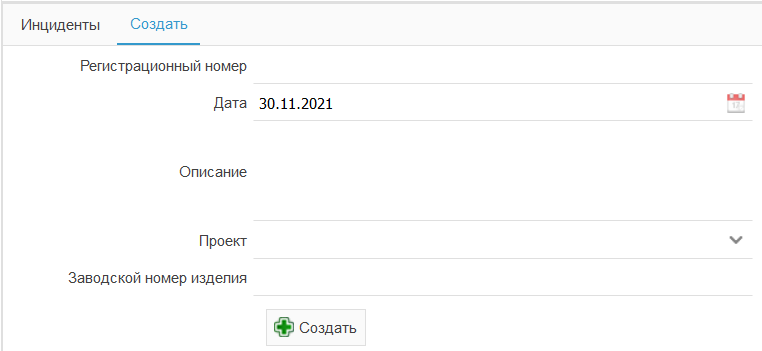

заполнить свойства инцидента и нажать кнопку **Создать**.

#### Редактирование инцидента
Открытие конкретного инцидента на просмотр/редактирование осуществляется двойным кликом указателя мыши по строке с инцидентом.
Форма свойств инцидента отрывается в новом окне браузера.
Кроме возможности просмотра и редаткирования свойст самого инцидента на неу можно также:
Просматривать присоединенные к инциденту файлы и добавлять новые.

## Работа с конструкторским составом

### Создание нового элемента конструкции
Выбираем пункт меню **Работа с составом** и далее нужный раздел (тип) объектов.
На открывшемся дашборде со списком объектов выбираем вкладку **Создать** (необходимо наличие прав доступа).
Заполняем поля со свойствами нового объекта. В зависимости от типа элемента набор свойств для заполнения может меняться.
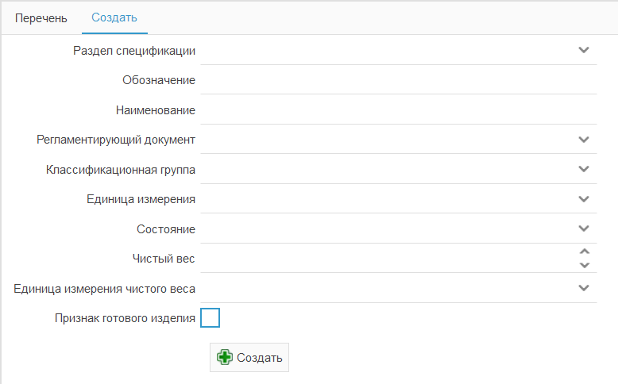

После нажатия кнопки **Создать** элемент будет добавлен в базу данных с указанными свойствами. На панели сообщений будет выведено сообщение об ошибке и

### Добавление нового элемента в состав
Любым доступным способом найдите объект, состав которого нужно отредактировать. Работа с составом объекта производится на вкладке **Состав**.
Данная вкладка преназначена для добавления новых позиций в состав, а также редактирования ранее введенной информации о составе.
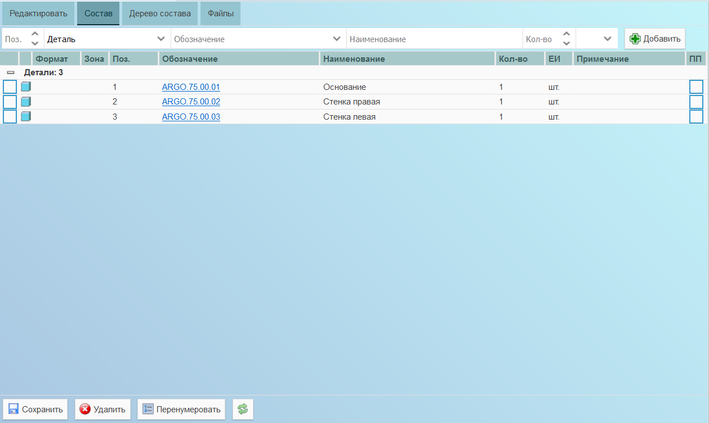
Форма добавления нового элемента состава находится в верхней части дерева состава.
Укажите свойства добавляемого объекта:
* Номер позиции (после добавления новой позиции автоматически увеличивается на еденинцу для удобства)
* Раздел спецификации, к которому относится добавляемый объект
* Обозначение добавляемого объекта (если в базе данных нет указанного объекта, то он будет создан)
* Наименование (при выборе существующего объета в предыдущем поле будет заполнено его наименованием)
* Количество данных объектов в составе
* Единица имзерения количества (при выборе существующего объета в поле будет заполнено его единицей измерения)
После заполнения полей нажмите кнопку **Добавить**. При добавлении объекта в состав система проверяет:
* уникальность номера позиции
* отсутствтие повтора объекта в составе
* отсутствие циклической ссылки

### Редактирование состава
На вкладке **Состав**"** отображется конструкторский состав текущего объекта конструкции. Для удобства просмотра выполнена руппировка по разделам спецификации с подсчетом строк.
Для **редактирования** записи (записей) из ее (их) нужно отметить галочкой в первом столбце, отредактировать свойства (Зона, Позиция, Количество, Примечание) и нажать кнопку "Сохранить".
Для **удаления** записи (записей) из ее (их) нужно отметить галочкой в первом столбце и нажать кнопку "Удалить".
Если необходимо заменить один объект другим, то необходимо сначал удалить старый объект, затем добавить новый.
Кнопка "Перенумеровать" осуществляет перенумерацию строк. Перед нажатием кнопки нужно отметить начальную строку для осуществления перенумерации и указать номер, который она должна получить. В результате перенумерации эта строка получит указанный номер, а последующие - номера далее по порядку.
Кнопка "Обновить" перезагружает содержимое вкладки.

### Разработчики
Справочник разработчиков окрывается по выбору пункта меню **Справочнки - Разработчики**.
В открывшемся окне можно просматривать добавленных в спрачник разработчиков.

#### Добавление нового разработчика
Находясь в справочнике разработчков переключаемся на вкладку "Создать".
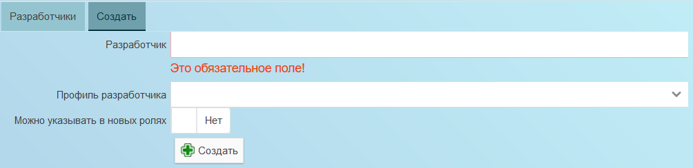
Заполняем свойства нового разработчика:
* Разработчик. Как данный разработчик будет отображаться в ролях.
* Профиль разработчика. Для сопоставления разработчика и профиля пользователя. Один профиль может соотвествовать одному разработчику.
* Можно указывать в новых ролях. Будет ли возможность указывать данного разработчика в ролях разработки.
Нажимаем кнопку "Создать".

## Технология изготовления

Работа с технологическим процессом изаготовления ДСЕ осуществляется на отдельной странице. Переход на нее осуществляется
по ссылке "Технология изготовления" на вкладке "Еще..." на странице со свойствами ДСЕ.
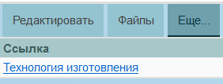
Если пользователю недоступна дананя ссылка, нужно обратиться к администратору системы.

### Дерево технологического процесса
Информация о технологии производства ДСЕ представлена в виде дерева Маршрут - Элементы маршрута - Операции - Ресурсы

### Производственный маршрут

### Элемент производственного маршрута

### Операция

### Потребляемый на операции ресурс

## Управление производством

### Работа с заказами

#### Добавление нового заказчика
Выбираем пункт меню **Производство - Заказы**.
Переключаемся на вкладку "Создать".
Заполняем свойства нового заказа.
Нажимаем кнопку Создать.

#### Добавление нового заказа
Выбираем пункт меню **Производство - Заказчики**.
Переключаемся на вкладку "Создать".
Заполняем свойства нового заказа.
Нажимаем кнопку Создать.

#### Добавление новой детали
Выбираем пункт меню **Работа с составом - Детали**.
Переключаемся на вкладку "Создать".
Заполняем свойства новой детали.
Нажимаем кнопку Создать.

#### Добавление детали в заказ
Выбираем пункт меню **Производство - Заказы**.
Находим нужный нам заказ и открываем его на редактирование двойным кликом.
Переключаемся на вкладку "Состав заказа".
Указываем детали, количество и примечание (если необходимо).
Нажимаем кнопку "Добавить".

#### Назначение исполнителей для позиций в заказе
Выбираем пункт меню Производство - Заказы.
Находим нужный нам заказ и открываем его на редактирование двойным кликом.
Переключаемся на вкладку "Состав заказа".
Выбираем строку в составе, для которой нужно указать исполнителя.
Справа выбираем панель "Исполнители". указываем исполнителя и количество.
Нажимаем кнопку "Добавить".

#### Отметка исполнителя о выполненных заданиях

## Работа с настройками

### Работа с настройками пользователей
Выбираем пункт меню **Настройки - Пользователи**.
Откроется текущий список зарегистрированных в системе пользователей.
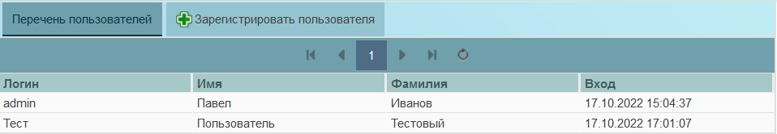
Слева расположено поле для ввода фильтрующего список фрагмента текста.
Справа отображаются группы доступа с отметками о членстве в них выбранного в списке пользователя.
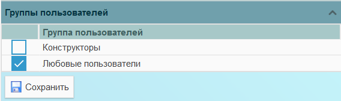
Чтобы отредактировать членство пользователя в группах достпа нужно отметить галочки в нужных группах и убрать в ненужных. Затем нажать кнопку "Сохранить".

#### Регистрация пользователя
Для добавления нового пользователя используется вкладка "Зарегистрировать пользователя".
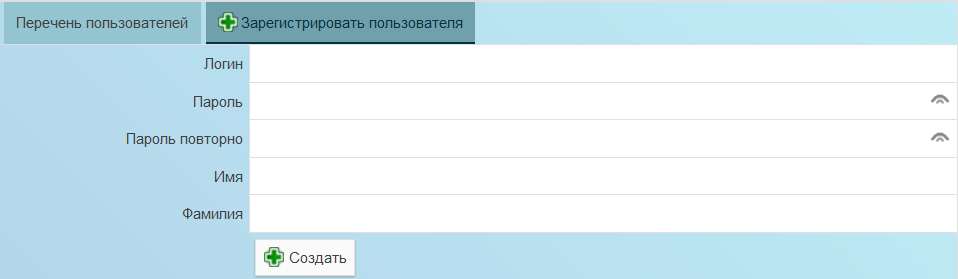
Заполняем свойства нового пользователя:
* Логин. Уникальное имя, которое пользователь будет использовать при входе
* Пароль. Пароль пользователя (в дальнейшем пользователь, при необходимости, сможет его поменять)
* Пароль повторно. Для проверки правильности ввожа пароля.
* Имя. Имя пользователя (можно Имя Отчество)
* Фамилия. Фамилия пользователя.
Нажимаем кнопку "Создать".

#### Редактирование пользователя
Двойной клик по строке в списке пользователей (пункт меню **Настройки - Пользователи**) открывает на новой странице браузера форму свойств выбранного пользователя. В ней можно отредактировать все свойства пользователя. См. выше Регистрация пользователя.

#### Создание профиля пользователя
Профили пользователя использются для ввода дополнительной информации о пользователе. Одному пользователю может быть соспоставлен только один профиль.
Выбираем пункт меню **Настройки - Профили пользователей**.
Переключаемся на вкладку "Создать профиль".
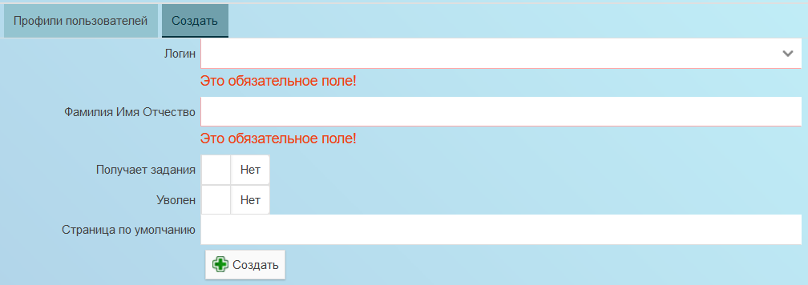
Заполняем свойства нового профиля:
* Логин. Ранее зарегистрированный Логин пользователя, для сопоставления в момент входа.
* Фамилия Имя Отчество. Польное Ф.И.О. пользователя для отображения на формах.
* Получает задания. Признак того, что пользователю может быть выдано задание.
* Уволен. Признак, что пользователь уволен. Он не сможет входить в систему и т.п.
* Страница по умолчанию. ссылка на страницу, которая открывается пользователю после входа. По умаолчанию используется search (Поиск).
Нажимаем кнопку "Создать".

#### Редактирование профиля пользователя
Двойной клик по строке в списке профиля пользователей (пункт меню **Настройки - Профили пользователей**) открывает на новой странице браузера форму свойств выбранного профиля пользователя. В ней можно отредактировать все свойства профиля. См. выше Создание профиля пользователя.
